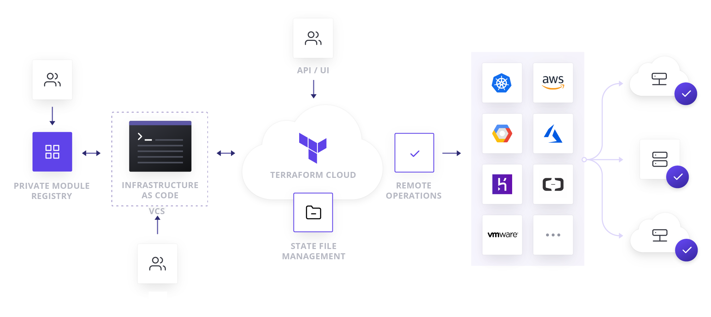
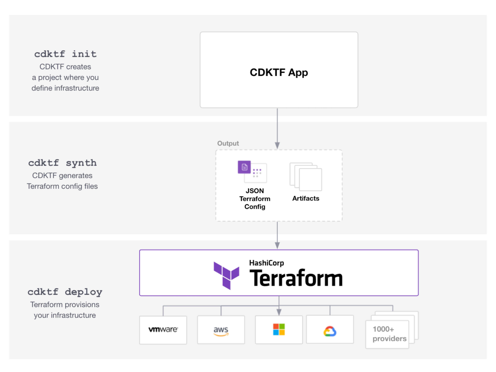

# 나만의 Infrastructure Template 정의하기
2023.03.17  황성찬

---

# Do not Repeat Yourself!
* 유명한 프로그래밍 격언
* 그러나 우린 매번 반복을 저지르고 있다.

---

# When we repeat ourselves?
* 새로운 토이 프로젝트를 시작할 때!
* 토이 프로젝트의 뻔한 인프라 셋팅을 직접 AWS Console에서 생성하고 제거

---

# Trouble
* 쌓여가는 정체모를 보안그룹, SSH-Key Pair, IAM 들..

---

# Use CDK TF!
* IaC 도구를 사용해서 나만의 인프라 구조를 정의해두자
* 명령어 한 줄로 서버 셋팅을 끝낼 수 있다.
* 당신의 Favorite Language를 사용해서 TF를 다룰 수 있음.

---
# Terraform Basic
* Write
* Plan
* Apply

---
# Terraform Basic2

---

# CDK TF Basic
* 모든 구성요소는 Construct의 하위 개념이다.
* App, Stack, Resource로 구성된다.
* App은 Stack 뭉치, Stack은 Resource 뭉치

---

# What kind of infrastrucrue you want?
* 영속성
  * Database, S3
* 무중단 배포
  * Elastic Beanstalk
* 웹 기반 Log 모니터링
  * Cloudwatch
* Domain 연동
  * Route53, ALB
* 무과금

---

# Benefit
* 일관성 있는 환경 별 인프라 배포(dev, prod)
* easy 인프라 철거
* 프리티어 종료 시 계정 이사
* 시간 절약

---

# Live Demo

---

# Goals
* AWS Freetier 대부분의 서비스들을 enable/disable 사용 가능한 형태
* Github Action 형태로 제공
* 이사를 돕는 데이터 백업 플랜
