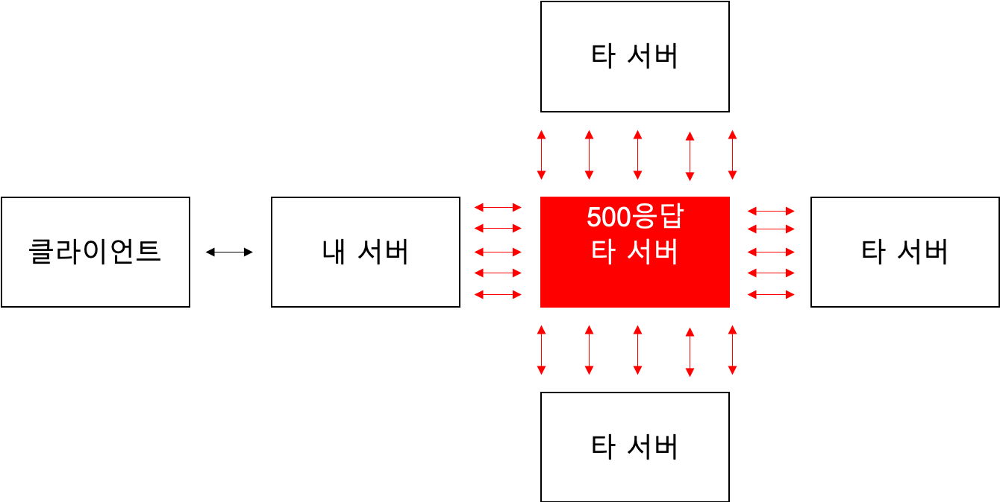
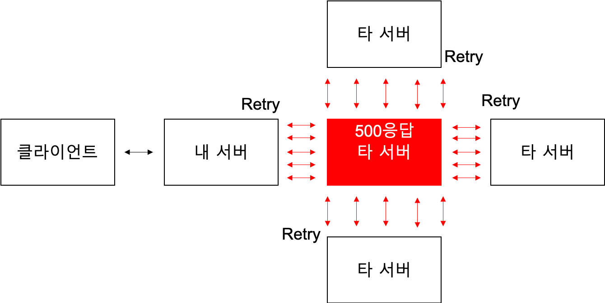
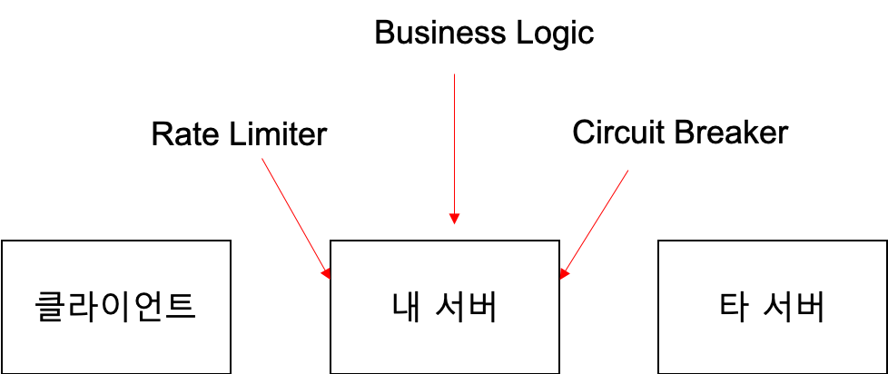

# 분산 시스템 환경에서  Circuit Breaker로 사이좋게 통신하기
2023.03.21 황성찬

---

# 목차
* 발표자 소개
* 사이가 나빠지는 통신 시나리오
* 금쪽이를 위한 박사님의 솔루션
  * Circuit Breaker
  * Rate Limiter
* 도입 후기

---

# 발표자 소개

* 황성찬
  * AWS 판교 소모임 운영진
  * AWS Community Builders
  * 백엔드 엔지니어 

---

# 이런 분산 시스템

---

# 이런 분산 시스템

---

# 사이가 안좋아지는 시나리오

---

# 사이가 안좋아지는 시나리오

---

# 금쪽이를 위한 솔루션: 싸우지 말자
* Circuit Breaker로 자동으로 트래픽을 차단하거라.
* 근데 Circuit Breaker가 뭐길래?

---

# Circuit Breaker

* 유한 상태 머신의 구현체
* OPEN, HALF OPEN, CLOSED 상태
* DISABLED, FORCE OPEN 상태

---

# Circuit Breaker: 상태 변경 기준
* Count-based sliding window
* Time-based sliding window
* Failure rate and slow call rate thresholds

---

# Why Circuit Breaker?
* 내 서버도 Client에게 500 응답을 Relay하면 되는거 아닌가? 왜 써야하지?

---

# 사이가 안좋아지는 시나리오: Retry 지옥

---

# 사이가 안좋아지는 시나리오: 프로세스 재시작 지옥

---

# How about Retry?
* 내 서버에서 Error 발생 시 Retry를 하고 있다면?
* 평소보다 2배 3배 많은 트래픽이 발생할 수 있다.
* 여러 서버에서 모두 Retry를 수행하면 서버가 죽는다.
* 그러면 Retry 제거 배포하면 되는거 아님?

---

# Client Retry
* 클라이언트에 신규 업데이트를 반영하는 것은 쉬운일이 아니다.
* 결국은 내 서버에서 트래픽을 차단해줘야 한다.

---

# Circuit Breaker
* 상대 서버를 지키기 위한 장치.
* 상대 서버가 에러 응답을 주는 상황에서만 유효하다.
* 장애를 해결해주지 않는다.
* 전체적인 트래픽 흐름으로 봤을 때는 결국 Fail Fast에 불과하다.

---

# 사이가 안좋아지는 시나리오2: 서버 코드 정상 / 응답 필드 이상
* 타 서버가 정상적으로 응답하지만 응답값이 충분하지 않을 때
* 또 다시 Client Retry * 내 서버 Retry 출동!

---

# Rate Limiter

* cycle 내에 허용되는 요청의 수를 제한한다.
* 허용 요청 수가 고갈되면 에러 응답

---

# Rate Limiter
* 나의 서버를 지키는 기술 && 남의 서버를 지키는 기술
* Circuit Breaker == 남의 서버를 지키는 기술

---

# 도입 후기
* 웬만하면 사용하지 말자
* 엔지니어링 난이도가 매우 높다.
* 반드시 모니터링하자
* Rate Limiter , Circuit Breaker를 함께 사용하자

---

# 진짜 왠만하면 사용하지 말자
* 타 팀에게 서버 Scale Up/Out을 요청한다.
* Retry 설정은 신중하게 하자.

---

# 반드시 모니터링하자
* Why?
  * 지속적으로 지표를 살펴보며 parameter tuning이 필요하다.
* What?
  * inbound / outbound 
    * latency, connection pool, response code
  * Circuit Breaker
    * OPEN? CLOSE?
  * Rate Limiter
    * active permissions

---

# 모니터링이 필요한 이유
* WebClient 의 connection이 고갈되어서 요청이 못가는건지?
* Rate Limiter Permission이 고갈되어서 요청이 못가는건지?
* 외부 서버가 에러 응답을 내려줘서 Circuit이 열렸는지?

 

---

# Summary
* 안쓸 수 있다면 쓰지말자!!!
* Circuit Breaker
  * 다른 서버를 지키기 위한 장치
* Rate Limiter
  * 내 서버와 다른 서버를 지키기 위한 장치
* 반드시 모니터링과 함께 사용하자
  * inbout / outbound
  * Circuit status
  * Rate Limiter active permissions
